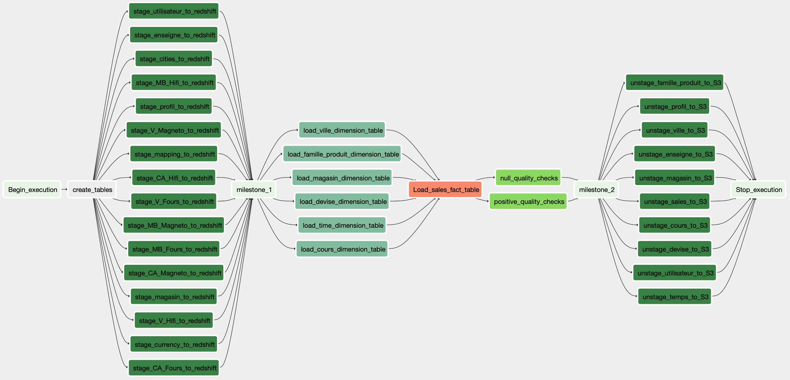

# Darties - Data Engineering project 6 -  Data Warehouse with AWS Redshift and Airflow

By Alessio Rea

==============================

You need to have Python 3.8.5 installed for this project. You also need to have docker in order to run **Airflow**.

# Context of the project

Darties is a french firm that sells secialized products, such as home appliances, audiovisual and computer equipment. It is composed of three brands : 

- *Darty*, 
- *Leroy-Merlin* and
- *Boulanger*. 

It sells three families of products : 
- *hi-fi systems*, 
- *ovens* and 
- *video recorders*.

Currently, the situation is the following :
- No information system,
- Excel sheets are used as decision tools,
- data between stores is hard to compare,
- The tree structure is the following :
    - 1 Commercial Director,
    - 5 Regional Directors :  *Ile de France*, *Nord-est*, *Nord-Ouest*, *Sud-Est*, *Sud-Ouest*,
    - 48 Store managers,


The needs of the client are :
- To create a dashboard allowing to do the following :
    - Activity monitoring :
        - For the countries,
        - For the regions,
        - For the stores.
    - Facilitate :
        - Analysis of the situation,
        - Decision making,
- Conformity of performances with respect to the objectives,
- Communicate / Inform


In order to do so we have :
- 3 activity indicators  : Turnover, Margin rate, Number of sales,
- 2 year visibility


# Technical insights 

## 1. Purpose of the project

The purpose of the project is to build an **ETL pipeline** that extracts data from S3, stages it in **Redshift**, and transforms data into a set of dimensional tables for analysis and insights in how and when sales are being performed. Data is modelled according to a star schema with fact and dimension tables for fast and easy analysis. **Redshift** gives the opportunity to execute SQL statements that create the analytics tables from these staging tables.

We will also introduce automation and monitoring to a data warehouse ETL pipelines using **Apache Airflow**. **Airflow** allows to create high grade data pipelines that are dynamic and built from reusable tasks, that can be monitored, and allow easy backfills. It also allows to monitor data quality which plays a big part when analyses are executed on top the data warehouse, in that it allows to run tests against our datasets after the ETL steps have been executed to catch any discrepancies in the datasets. We will have two dags in this project. The intial dag for gathering and precleaning data, and the global dag to process data in Redshift.

- Initial dag :
    

- Global dag :
    

Lastly, we will add a data visualization layer with **AWS Quicksight**.


## 2. Initial data
Part of the initial data is provided through in excel files. For each item and each families of products, those files look like this :


We also have some information about cities in an excel file that looks like this :


We will also need to webscrap some missing parts. In order to do so, we will use the python library beautifulsoup :
- The currencies and their rate change we need to convert from one currency to another will be retrieved from the following url : https://www.capital.fr/bourse/devises/cours-devises


## 3. Database schema design and ETL pipeline

In this project, the initial data is first cleaned and then pushed to a AWS S3 bucket before processing. Following is the structure of the data you will find in the S3 bucket.

-  Sales Dataset
    
    Sales data is organized by category and year. Here is a filepath to three files that could be found in such a dataset :

    - Turnover (CA) for ovens (Fours) in 2020

    ```
    CA_Fours/2020/CA_Fours_2020_sales.json
    ```
    
    - Gross Margin (MB) for Hifi in 2020

    ```
    MB_Hifi/2020/MB_Hifi_2020_sales.json
    ```
    
    - Sales (V) for recorders (Magneto) in 2020

    ```
    V_Magneto/2020/V_Magneto_2020_sales.json
    ```

    Here is an example of what a single sale object may look like :

    ```
    {"Villes":"Alencon","O_Janvier":20.3,"R_Janvier":33.8,"O_Fevrier":33.8,"R_Fevrier":40.5,"O_Mars":40.5,"R_Mars":27.0,"O_Avril":13.5,"R_Avril":33.8,"O_Mai":418.6,"R_Mai":499.7,"O_Juin":276.8,"R_Juin":472.7,"O_Juillet":189.1,"R_Juillet":222.8,"O_Aout":276.8,"R_Aout":182.3,"O_Septembre":182.3,"R_Septembre":114.8,"O_Octobre":216.1,"R_Octobre":384.9,"O_Novembre":270.1,"R_Novembre":168.8,"O_Decembre":445.7,"R_Decembre":465.9}
    ```

    Those files contain the following features : 'City', and then for every month, previsional and real sales. For example, in the above json object found in *V_Magneto/2020/V_Magneto_2020_sales.json*, we know that for the french city of *Alencon* in 2020, the previsional sales (V) of recorders (Magneto) in january (O_Janvier) were 20.3 and the real sales  of recorders in january were 33.8.


-  General information Dataset
    
    Here is a filepath to one file that could be found in such a dataset :

    ```
    darties/2020/sales.json
    ```

    Here is an example of what a single sale object may look like :

    ```
    {"City":"Alencon","Brand":"Darty","Ads":116.2,"Region":"Nord_Ouest","Location":"Centre_Ville","Nb_cash_register":15,"Population":1394451,"Blue_collar_rate":14.7,"White_collar_rate":2.7,"Jobless_rate":39.4,"Lt_25_yo":35.5,"25_35_yo":14.6,"gt_35_yo":49.9}
    ```

    Those files contain the following features : 'City', 'Brand', 'Ads', 'Region', 'Location', 'Nb_cash_register', 'Population', 'Blue_collar_rate', 'White_collar_rate', 'Jobless_rate', 'Lt_25_yo', '25_35_yo', 'gt_35_yo'.


Here is how the data is modelled according to a star schema :

- **Sales** : Fact table. For a given **city**, at a given **time**, for a given **product family** (ovens, hi-fi systems or video recorders) and in a given **store**, what were the previsional and real **sales**, what were the previsional and real **turnover** and what were the previsional and real **gross margin**. 


- Dimension tables : 

    - **famille_produit** - category of product (ovens, hi-fi systems or video recorders). Features : description of the product.
    - **ville** - city. Features : description of the city.
    - **magasin** - store. Features : description of the store.
    - **temps** - time. Features : description of the time.
    - **enseigne** - brand. Features : description of the brand.
    - **utilisateur** - user. Features : description of the user.
    - **profil** - profile. Features : description of the profile.
    - **cours** - currency rate. Features : description of the currency rate.
    - **currency** - currency. Features : description of the currency.
    - **parametre** - parameter. Features : description of the parameters.


## 4. Example queries and results for sales analysis

Once the data has been ETLed, you are free to take full benefit from the power of star modelling and make business driven queries like :

    - What was the turnover for recorders in the first semester of 2020 in Paris ?
    - What was the amount of sales for hifi in the march 2021 in Lyon ?
    - What was the gross margin for ovens in the department (french administrative division) of Rhône in the second trimester of 2020 ?


# Project Organization 
----------------------

    ├── Dockerfile
    ├── README.md
    ├── activate.sh
    ├── airflow
    │   ├── =1.0.0
    │   ├── __init__.py
    │   ├── __init__.pyc
    │   ├── airflow.cfg
    │   ├── airflow.db
    │   ├── app
    │   │   ├── __init__.py
    │   │   ├── __pycache__
    │   │   │   └── __init__.cpython-37.pyc
    │   │   ├── config
    │   │   │   ├── __init__.py
    │   │   │   ├── __pycache__
    │   │   │   └── config.py
    │   │   └── infrastructure
    │   │       ├── SalesData.py
    │   │       ├── __init__.py
    │   │       └── __pycache__
    │   ├── dags
    │   │   ├── create_tables.sql
    │   │   ├── global_dag.py
    │   │   └── initial_dag.py
    │   ├── data
    │   │   ├── 2020_HISTO.xlsx
    │   │   ├── 2021_BUDGET.xlsx
    │   │   └── README.md
    │   ├── logs
    │   │   └── README.md
    │   ├── output
    │   │   ├── CA_Fours
    │   │   │   ├── 2020
    │   │   │   │   └── CA_Fours_2020_sales.json
    │   │   │   └── 2021
    │   │   │       └── CA_Fours_2021_sales.json
    │   │   ├── CA_Hifi
    │   │   │   ├── 2020
    │   │   │   │   └── CA_Hifi_2020_sales.json
    │   │   │   └── 2021
    │   │   │       └── CA_Hifi_2021_sales.json
    │   │   ├── CA_Magneto
    │   │   │   ├── 2020
    │   │   │   │   └── CA_Magneto_2020_sales.json
    │   │   │   └── 2021
    │   │   │       └── CA_Magneto_2021_sales.json
    │   │   ├── MB_Fours
    │   │   │   ├── 2020
    │   │   │   │   └── MB_Fours_2020_sales.json
    │   │   │   └── 2021
    │   │   │       └── MB_Fours_2021_sales.json
    │   │   ├── MB_Hifi
    │   │   │   ├── 2020
    │   │   │   │   └── MB_Hifi_2020_sales.json
    │   │   │   └── 2021
    │   │   │       └── MB_Hifi_2021_sales.json
    │   │   ├── MB_Magneto
    │   │   │   ├── 2020
    │   │   │   │   └── MB_Magneto_2020_sales.json
    │   │   │   └── 2021
    │   │   │       └── MB_Magneto_2021_sales.json
    │   │   ├── README.md
    │   │   ├── V_Fours
    │   │   │   ├── 2020
    │   │   │   │   └── V_Fours_2020_sales.json
    │   │   │   └── 2021
    │   │   │       └── V_Fours_2021_sales.json
    │   │   ├── V_Hifi
    │   │   │   ├── 2020
    │   │   │   │   └── V_Hifi_2020_sales.json
    │   │   │   └── 2021
    │   │   │       └── V_Hifi_2021_sales.json
    │   │   ├── V_Magneto
    │   │   │   ├── 2020
    │   │   │   │   └── V_Magneto_2020_sales.json
    │   │   │   └── 2021
    │   │   │       └── V_Magneto_2021_sales.json
    │   │   └── darties
    │   │       ├── 2020
    │   │       │   └── darties_2020_sales.json
    │   │       └── 2021
    │   │           └── darties_2021_sales.json
    │   ├── plugins
    │   │   ├── __init__.py
    │   │   ├── __pycache__
    │   │   │   └── __init__.cpython-37.pyc
    │   │   ├── config
    │   │   │   ├── __init__.py
    │   │   │   ├── __pycache__
    │   │   │   └── config.py
    │   │   ├── helpers
    │   │   │   ├── __init__.py
    │   │   │   ├── __pycache__
    │   │   │   └── sql_queries.py
    │   │   ├── infrastructure
    │   │   │   ├── SalesData.py
    │   │   │   ├── __init__.py
    │   │   │   └── __pycache__
    │   │   └── operators
    │   │       ├── __init__.py
    │   │       ├── __pycache__
    │   │       ├── clean_file.py
    │   │       ├── data_quality.py
    │   │       ├── load_dimension.py
    │   │       ├── load_fact.py
    │   │       ├── stage_redshift.py
    │   │       └── upload_file.py
    │   └── unittests.cfg
    ├── airflow.cfg
    ├── airflow.db
    ├── app
    │   ├── __init__.py
    │   ├── __pycache__
    │   │   ├── __init__.cpython-37.pyc
    │   │   └── __init__.cpython-38.pyc
    │   ├── application
    │   │   ├── create_output_file.py
    │   │   └── upload_file.py
    │   ├── config
    │   │   ├── __init__.py
    │   │   ├── __pycache__
    │   │   └── config.py
    │   ├── domain
    │   │   ├── BusinessData.py
    │   │   └── __pycache__
    │   │       ├── BusinessData.cpython-37.pyc
    │   │       └── BusinessData.cpython-38.pyc
    │   └── infrastructure
    │       ├── SalesData.py
    │       ├── __init__.py
    │       └── __pycache__
    ├── dwh_P6.cfg
    ├── generals
    │   ├── star_schema.png
    │   └── Présentation\ Projet\ Darties.pdf
    ├── init
    ├── init.sh
    ├── poetry.lock
    ├── pyproject.toml
    ├── requirements.txt
    ├── unittests.cfg
    ├── utils
    │   ├── IaC_1.py
    │   ├── IaC_2.py
    │   ├── create_bucket.py
    │   ├── release_resources.py
    │   ├── settings.py
    │   └── upload_file.py
    └── utils.txt


# Getting started

## 1. Clone this repository

```
$ git clone <this_project>
$ cd <this_project>
```

## 2. Install requirements

I suggest you create a python virtual environment for this project : <https://docs.python.org/3/tutorial/venv.html>

I had a problem installing psycopg2. The following lines did the trick though :

```
- export LDFLAGS="-L/usr/local/opt/openssl/lib"
- export CPPFLAGS="-I/usr/local/opt/openssl/include"
```

```
$ pip install -r requirements.txt
```

--------


## 2. Configuration of project

You need to have an AWS account to run the complete analysis. You also need to create a user that has AmazonRedshiftFullAccess as well as AmazonS3ReadOnlyAccess policies. Make sure to keep its KEY and SECRET credentials in a safe place.

1. Copy the *dwh.cfg* into a safe place.
2. Fill in all fields except *LOG_DATA*, *LOG_JSONPATH*, *SONG_DATA* which are already filled and *DWH_ENDPOINT*, *DWH_ROLE_ARN* which will be automatically filled for you. 
3. In file *settings.py*, give the path to *dwh.cfg* to variable *config_file*.
4. Run *IaC_1.py* and wait untill you see the cluster available in your console.
4. Run *IaC_2.py*.
5. Run *create_tables.py* and check that all tables are created in the redshift query editor.
6. Run *etl_staging.py*, then *etl_tables.py*. In the query editor, run queries to ensure that tables *staging_events* and *staging_songs* and other fact and dimension tables are properly populated.
7. Fill free to write queries in *test.py* to analyse the data.
8. Once done, don't forget to *release_resources.py* !!!!


9. Start **Docker** desktop and run the following command : *docker run -d -p 8080:8080 -v /Users/alexei/docs/MIAGE/S4/D605/darties/airflow:/usr/local/airflow puckel/docker-airflow webserver*


--------


